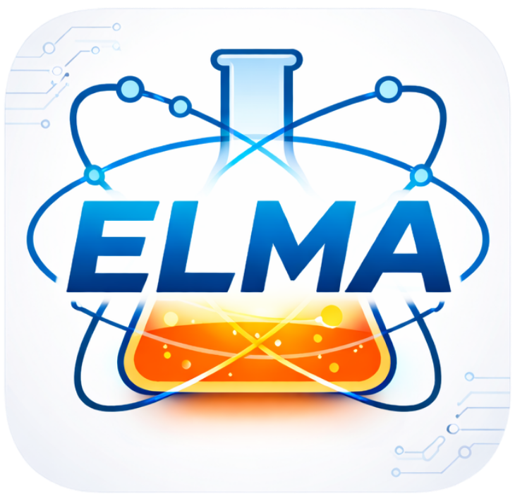

# Guia de Estilo e Identidade Visual (Design System Oficial)
### Laboratório de Monitoração Ambiental (LMA / ELMA) & Eletronuclear

Este documento define as **diretrizes visuais normativas e técnicas** para padronização de interfaces web, formulários de qualidade, sistemas internos e documentos impressos/PDFs, garantindo identidade coerente, acessibilidade e facilidade de reaproveitamento em futuros projetos.

---

## 1. Princípios Fundamentais de Design

1. **Rigor e Sobriedade Técnica (ISO/IEC 17025):** 
   - A interface deve comunicar precisão técnica, confiabilidade e seriedade laboratorial.
2. **100% Cantos Retos (`border-radius: 0px`):**
   - Geometria puramente retilínea em todos os elementos estruturais e interativos (cartões, botões, modais, formulários, badges e avatares).
3. **Clareza Visual sem Ruídos:**
   - Proibição absoluta de bordas laterais coloridas grossas (`border-left` espesso) que desequilibram o layout e geram confusão visual.
4. **Legibilidade e Contraste Máximo:**
   - Botões de ação em **verde claro** acompanhados obrigatoriamente de **tipografia escura**, assegurando contraste acessível (WCAG AAA).
5. **Identidade Institucional Fiel:**
   - As marcas Eletronuclear e ELMA devem ser apresentadas de forma limpa, isoladas em fundo neutro e sem slogans complementares embutidos (ex: sem "Energia Limpa" abaixo do logotipo).

---

## 2. Paleta de Cores e Tokens CSS

Todos os valores estão centralizados no arquivo [`assets/css/design-system.css`](file:///f:/Tratamento%20de%20n%C3%A3o%20conformidades/assets/css/design-system.css).

### 2.1 Cores Primárias e Institucionais
| Nome do Token | Valor Hex | Aplicação |
| :--- | :--- | :--- |
| `--ds-navy` | `#0b3b60` | Barra superior (Header), títulos principais e bordas de foco. |
| `--ds-navy-dark` | `#07263e` | Hover em elementos marinho e rodapés institucionais. |
| `--ds-navy-light` | `#165b94` | Links secundários, seleções e estados ativos. |

### 2.2 Cores de Ação (Verde Claro com Alto Contraste)
| Nome do Token | Valor Hex | Aplicação |
| :--- | :--- | :--- |
| `--ds-green-action` | `#d9f99d` | Fundo padrão para botões de ação principal (Salvar, Confirmar). |
| `--ds-green-action-hover` | `#bef264` | Estado hover do botão de ação. |
| `--ds-green-action-active` | `#a3e635` | Estado active/pressionado do botão de ação. |
| `--ds-green-action-border` | `#84cc16` | Borda perimétrica de 1px para delimitação. |
| `--ds-green-text` | `#1a3806` | **Cor do texto obrigatória** (verde ultra-escuro para contraste AAA). |

### 2.3 Cores Estruturais e de Superfície
| Nome do Token | Valor Hex | Aplicação |
| :--- | :--- | :--- |
| `--ds-bg-page` | `#f4f7f9` | Fundo geral da aplicação. |
| `--ds-bg-card` | `#ffffff` | Superfície de cartões, formulários e modais. |
| `--ds-border` | `#cbd5e1` | Linhas delimitadoras e bordas de inputs. |
| `--ds-border-light` | `#e2e8f0` | Divisores sutis e tabelas. |
| `--ds-text` | `#1e293b` | Texto corrido e legendas de dados. |
| `--ds-muted` | `#64748b` | Informações secundárias e rótulos de metadados. |

### 2.4 Cores de Contexto (Caixas e Badges)
| Contexto | Fundo (`background`) | Borda (`border`) | Texto (`color`) |
| :--- | :--- | :--- | :--- |
| **Informativo (`.ds-box-info`)** | `#f0f7fb` | `#bae6fd` | `#0369a1` |
| **Sucesso / Concluído (`.ds-box-ok`)** | `#f0fdf4` | `#a7f3d0` | `#15803d` |
| **Atenção / Pendência (`.ds-box-warn`)** | `#fffbeb` | `#fde68a` | `#b45309` |
| **Crítico / Perigo (`.ds-box-danger`)** | `#fff1f2` | `#fecdd3` | `#991b1b` |

---

## 3. Tipos de Botões Padronizados

Os botões utilizam a classe base `.ds-btn` combinada com uma classe variante:

### 3.1 Botão Primário (Ação Principal)
- **Classe:** `.ds-btn .ds-btn-primary`
- **Uso:** Salvar registros, confirmar operações, cadastrar usuário, ações de avanço no fluxo.
- **Código HTML:**
  ```html
  <button type="button" class="ds-btn ds-btn-primary">
    + Salvar Registro
  </button>
  ```

### 3.2 Botão Secundário / Outline
- **Classe:** `.ds-btn .ds-btn-secondary`
- **Uso:** Ações neutras, voltar, cancelar, fechar janelas, filtros e navegação secundária.
- **Código HTML:**
  ```html
  <button type="button" class="ds-btn ds-btn-secondary">
    Fechar / Voltar
  </button>
  ```

### 3.3 Botão Crítico / Perigo
- **Classe:** `.ds-btn .ds-btn-danger`
- **Uso:** Excluir registros, reverter homologação, descartar alterações.
- **Código HTML:**
  ```html
  <button type="button" class="ds-btn ds-btn-danger">
    🗑️ Excluir Ocorrência
  </button>
  ```

---

## 4. Diretrizes para Caixas Informativas e Painéis

> [!CAUTION]
> **Regra Mandatória de Estilo:**
> **Nunca use bordas coloridas nas margens laterais (`border-left` grosso de 4px ou 5px).**
> Toda caixa informativa deve possuir borda perimétrica uniforme completa de 1px, fundo em tom suave pastel e cantos retos (`border-radius: 0px`).

### Exemplo Correto de Implementação:
```html
<!-- Caixa Informativa -->
<div class="ds-box ds-box-info">
  <b>Requisito 7.10 (ISO/IEC 17025):</b> Conter imediatamente o desvio e avaliar impacto retroativo.
</div>

<!-- Caixa de Sucesso -->
<div class="ds-box ds-box-ok">
  <b>Concluído:</b> Ação implementada e eficácia atestada com sucesso.
</div>
```

---

## 5. Padrão de Cabeçalho e Exibição de Logos

1. **Na Tela (Aplicação Web):**
   - O cabeçalho institucional (`.ds-header`) adota fundo azul marinho (`#0b3b60`).
   - Títulos e descrições do sistema à esquerda.
   - Logos oficiais (Eletronuclear + ELMA) agrupadas em um cartão branco retangular com cantos retos (`border-radius: 0px`) e borda sutil de 1.5px.
2. **Na Impressão e Relatórios PDF:**
   - Logotipo da Eletronuclear centralizado em sua célula de cabeçalho.
   - **Proibido inserir textos ou slogans adicionais abaixo da logo** (como "Energia Limpa").

```html
<header class="ds-header">
  <div class="ds-header-container">
    <div class="ds-header-titles">
      <h1>SISTEMA DE GESTÃO DA QUALIDADE</h1>
      <p>Laboratório de Monitoração Ambiental · IT-LM-GE-003</p>
    </div>
    <div class="ds-header-logos-box">
      
      <div class="ds-header-logos-divider"></div>
      
    </div>
  </div>
</header>
```

---

## 6. Ícones em SVG e Padronização Vetorial

- **ViewBox Padrão:** `0 0 60 60` para ícones de cards ou `0 0 24 24` para ícones utilitários inline.
- **Geometria de Contenção:** Qualquer `<rect>` ou `<circle>` estrutural deve ter cantos retos (`rx="0"`).
- **Higiene Vetorial:** Sem traços soltos, sobras de nós ou sombras de desfoque pesadas que causem artefatos visuais.

### Exemplo de SVG Limpo e Reto (Trabalho Não Conforme):
```xml
<svg viewBox="0 0 60 60" width="44" height="44" fill="none" xmlns="http://www.w3.org/2000/svg" style="display:block;border-radius:0px;">
  <rect width="60" height="60" rx="0" fill="#fee2e2"/>
  <path d="M30 10L52 48H8L30 10Z" fill="#dc2626" stroke="#991b1b" stroke-width="2" stroke-linejoin="round"/>
  <path d="M30 22V33" stroke="white" stroke-width="3" stroke-linecap="round"/>
  <circle cx="30" cy="40" r="2" fill="white"/>
</svg>
```

---

## 7. Como Importar em Novos Projetos

Basta copiar a pasta `assets/css/design-system.css` para o novo projeto e incluir no `<head>`:

```html
<link rel="stylesheet" href="assets/css/design-system.css">
```
Pronto! Todos os tokens, botões, caixas, cabeçalhos e estilos de formulários já estarão prontos para uso padronizado.
